# Biblioteca API

API REST desenvolvida em **ASP.NET Core (.NET 10)** para gerenciamento do acervo de livros de uma biblioteca. Permite cadastrar, consultar, atualizar e remover livros através de operações CRUD.

Contexto: o projeto simula o sistema de uma biblioteca que precisa controlar seu acervo de livros — cadastro, consulta, atualização de dados e disponibilidade para empréstimo. É destinado a bibliotecários ou a um sistema de front-end que consuma essa API para gerenciar o catálogo.

## Integrantes do Grupo

| Nome Completo | RM |
|---|---|
| Abner de Paiva Barbosa | RM558468 |
| Beatriz Vieira de Novais | RM554746 |
| Eduardo Dallabella Lima | RM556803 |
| Heloísa Real | RM554535 |
| Mariana Neugebauer Dourado | RM550494 |

## Tecnologias Utilizadas

- ASP.NET Core Web API (.NET 10)
- Entity Framework Core (Code-First)
- **Banco de dados: SQLite** (arquivo local `biblioteca.db`, recriado via Migration)
- Swashbuckle (Swagger/OpenAPI)

## Estrutura do Projeto

```
biblioteca-api/
├── Controllers/    -> Endpoints da API (LivrosController)
├── Models/         -> Entidade de domínio (Livro)
├── DTOs/           -> Objetos de transferência de dados (LivroRequestDto), com validações
├── Data/           -> DbContext do EF Core (AppDbContext)
├── Migrations/     -> Migrations do EF Core (histórico do schema do banco)
└── Program.cs      -> Configuração da aplicação, injeção de dependências e EF Core
```

## Entidade: Livro

| Campo | Tipo | Descrição |
|---|---|---|
| Id | int | Identificador único, gerado automaticamente |
| Titulo | string | Título do livro |
| Autor | string | Autor do livro |
| Genero | string | Gênero literário |
| Descricao | string | Descrição/sinopse do livro |
| AnoPublicacao | int | Ano de publicação |
| Disponivel | bool | Indica se o livro está disponível para empréstimo |

## Como Executar

### Pré-requisitos
- [.NET 10 SDK](https://dotnet.microsoft.com/download)
- Ferramenta `dotnet-ef` (CLI de Migrations do EF Core):
  ```bash
  dotnet tool install --global dotnet-ef
  ```

### Passos

1. Clone o repositório:
   ```bash
   git clone https://github.com/NeugeMa/biblioteca-api.git
   cd biblioteca-api/biblioteca-api
   ```

2. Restaure as dependências:
   ```bash
   dotnet restore
   ```

3. Aplique as Migrations para criar o banco SQLite local (`biblioteca.db`):
   ```bash
   dotnet ef database update
   ```
   Esse comando cria o arquivo `biblioteca.db` já com a tabela `Livros`, a partir da Migration `InitialCreate` (veja a pasta `Migrations/`). O arquivo `.db` não é versionado no Git — ele é sempre recriado localmente por esse comando.

4. Execute a aplicação:
   ```bash
   dotnet run
   ```

5. Acesse a interface do Swagger no navegador:
   ```
   http://localhost:5072/
   ```

   O Swagger UI é aberto diretamente na raiz da aplicação, com todos os endpoints disponíveis para teste.

### Sobre a Migration

A Migration inicial (`InitialCreate`, em `Migrations/`) foi gerada com:
```bash
dotnet ef migrations add InitialCreate
```
e cria a tabela `Livros` com todas as colunas da entidade, incluindo `Id` como chave primária autoincremento (`INTEGER PRIMARY KEY AUTOINCREMENT`).

## Endpoints Disponíveis

Todos os endpoints são versionados sob `/api/v1/`.

| Método | Rota | Descrição | Status de Sucesso | Status de Erro |
|---|---|---|---|---|
| GET | `/api/v1/livros` | Lista todos os livros | 200 OK | - |
| GET | `/api/v1/livros/{id}` | Busca um livro por Id | 200 OK | 404 Not Found |
| POST | `/api/v1/livros` | Cria um novo livro | 201 Created | 400 Bad Request (dados inválidos) |
| PUT | `/api/v1/livros/{id}` | Atualiza um livro existente | 204 No Content | 400 Bad Request / 404 Not Found |
| DELETE | `/api/v1/livros/{id}` | Remove um livro | 204 No Content | 404 Not Found |

O corpo do `POST`/`PUT` é validado via Data Annotations no DTO (`Titulo`, `Autor` e `Genero` obrigatórios, `AnoPublicacao` entre 1 e 2100) — uma requisição com dados inválidos retorna `400 Bad Request` com o detalhamento do erro.

## Exemplos de Chamadas

### Criar um livro (POST /api/v1/livros)

Requisição:
```json
{
  "titulo": "O Acordo (Nova Edição)",
  "autor": "Ellen Kennedy",
  "genero": "Romance",
  "descricao": "Hannah Wells finalmente encontrou alguém que a interessasse. Mas, embora seja autoconfiante em vários outros aspectos da vida, carrega nas costas uma bagagem e tanto quando o assunto é sexo e sedução. Não vai ter jeito: ela vai ter que sair da zona de conforto… Mesmo que isso signifique dar aulas particulares para o infantil, irritante e convencido capitão do time de hóquei, em troca de um encontro de mentirinha.",
  "anoPublicacao": 2026,
  "disponivel": true
}
```

Resposta (201 Created):
```json
{
  "titulo": "O Acordo (Nova Edição)",
  "autor": "Ellen Kennedy",
  "genero": "Romance",
  "descricao": "Hannah Wells finalmente encontrou alguém que a interessasse. Mas, embora seja autoconfiante em vários outros aspectos da vida, carrega nas costas uma bagagem e tanto quando o assunto é sexo e sedução. Não vai ter jeito: ela vai ter que sair da zona de conforto… Mesmo que isso signifique dar aulas particulares para o infantil, irritante e convencido capitão do time de hóquei, em troca de um encontro de mentirinha.",
  "anoPublicacao": 2026,
  "disponivel": true
}
```

### Atualizar um livro (PUT /api/v1/livros/1)

Requisição:
```json
{
  "titulo": "O Acordo (Nova Edição)",
  "autor": "Ellen Kennedy",
  "genero": "Romance",
  "descricao": "Hannah Wells finalmente encontrou alguém que a interessasse. Mas, embora seja autoconfiante em vários outros aspectos da vida, carrega nas costas uma bagagem e tanto quando o assunto é sexo e sedução. Não vai ter jeito: ela vai ter que sair da zona de conforto… Mesmo que isso signifique dar aulas particulares para o infantil, irritante e convencido capitão do time de hóquei, em troca de um encontro de mentirinha.",
  "anoPublicacao": 2026,
  "disponivel": true
}
```

Resposta: `204 No Content`

### Buscar livro inexistente (GET /api/v1/livros/999)

Resposta: `404 Not Found`

### Criar livro com dados inválidos (POST /api/v1/livros)

Requisição (título vazio):
```json
{
  "titulo": "",
  "autor": "Autor Teste",
  "genero": "Ficcao",
  "descricao": "Teste de validacao",
  "anoPublicacao": 2020,
  "disponivel": true
}
```

Resposta (400 Bad Request):
```json
{
  "title": "One or more validation errors occurred.",
  "status": 400,
  "errors": {
    "Titulo": ["O titulo e obrigatorio."]
  }
}
```

## Testes Realizados no Swagger

### 1. GET /api/v1/livros — lista vazia (banco recém-criado)
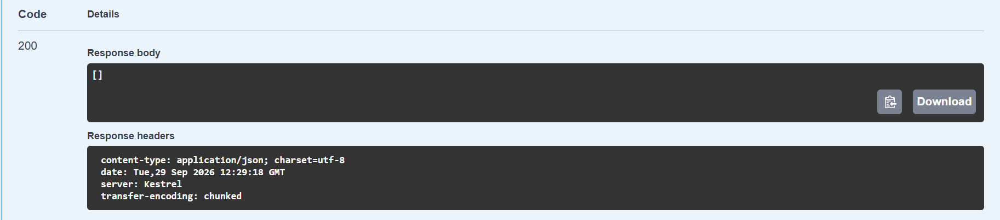

### 2. POST /api/v1/livros — criar livro válido
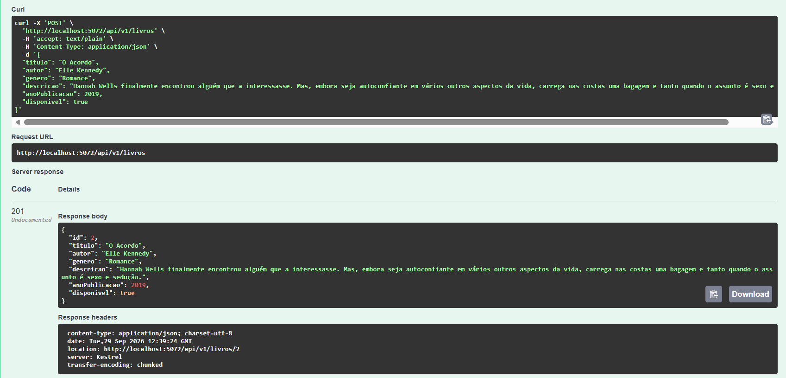

### 3. POST /api/v1/livros — corpo inválido (título vazio)
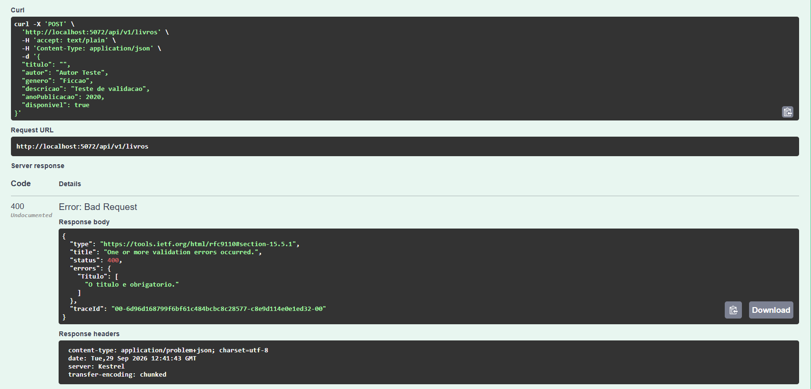

### 4. GET /api/v1/livros — listar após criação
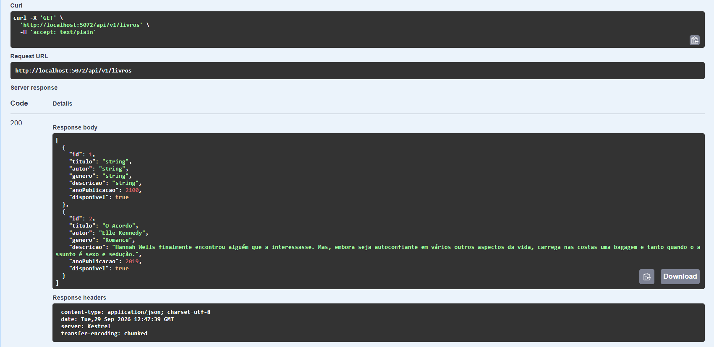

### 5. GET /api/v1/livros/{id} — buscar por id existente
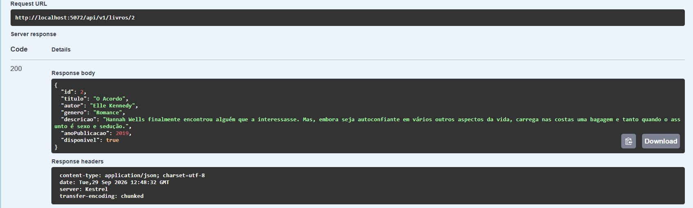

### 6. GET /api/v1/livros/{id} — buscar por id inexistente
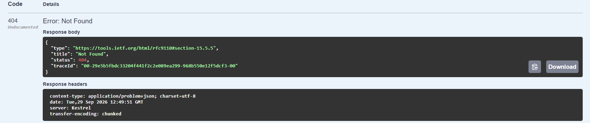

### 7. PUT /api/v1/livros/{id} — atualizar livro
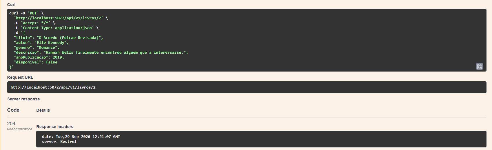

### 8. PUT /api/v1/livros/{id} — atualizar id inexistente
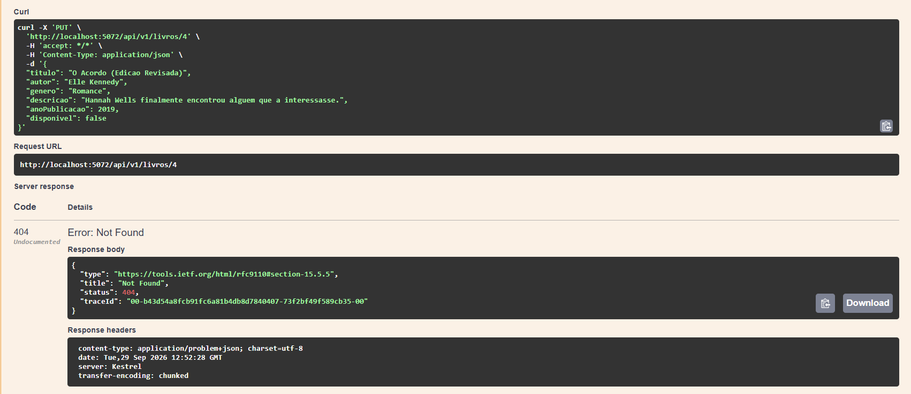

### 9. DELETE /api/v1/livros/{id} — remover livro
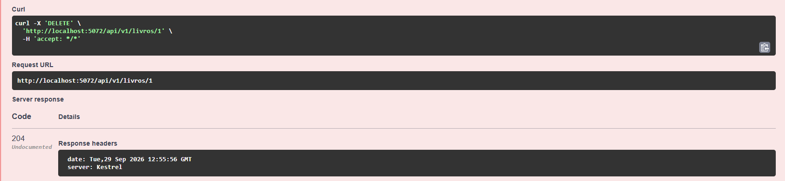

### 10. DELETE /api/v1/livros/{id} — remover id inexistente
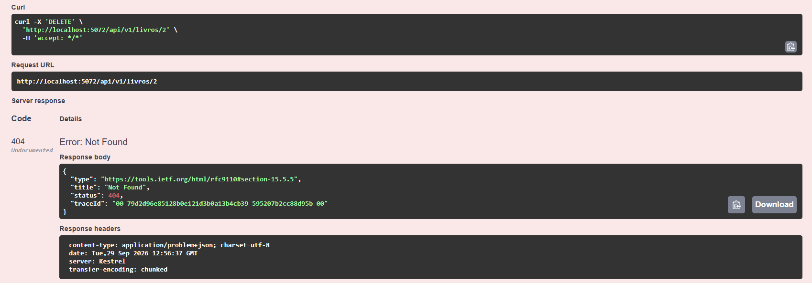

### 11. GET /api/v1/livros — lista final
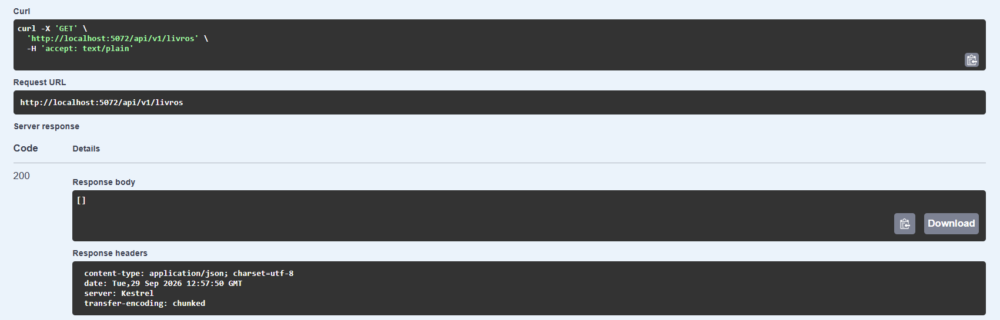
